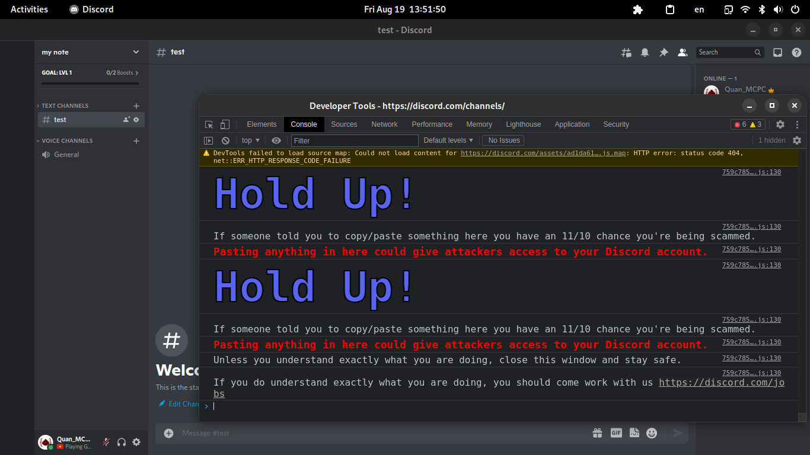
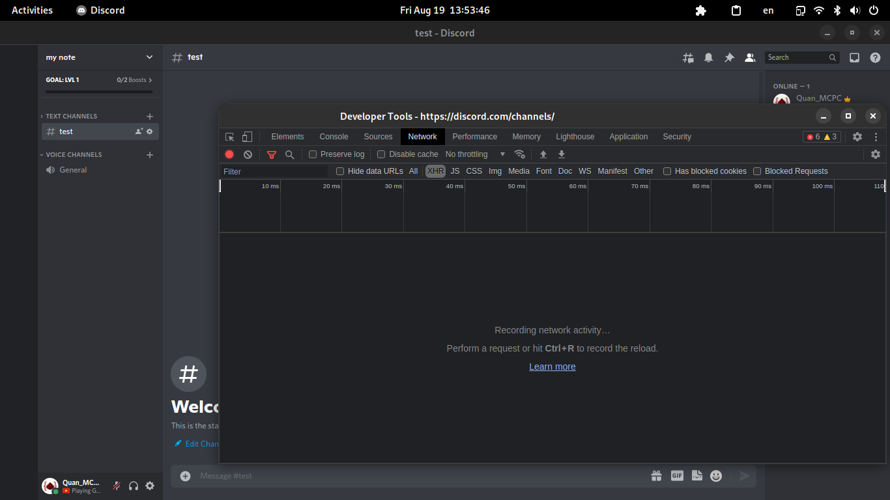
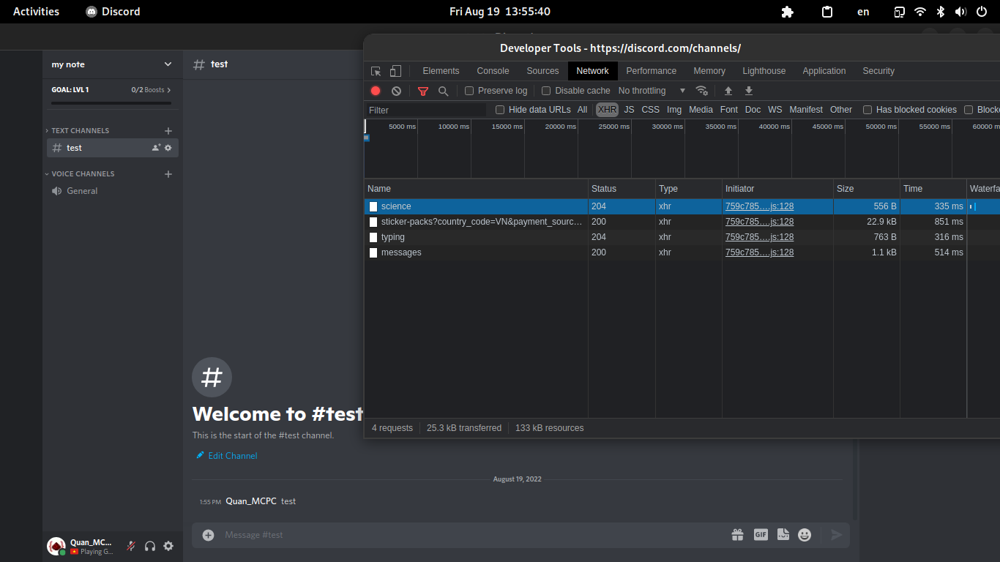
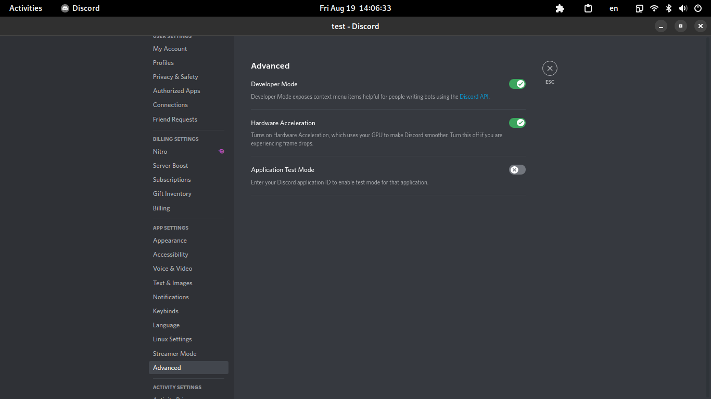
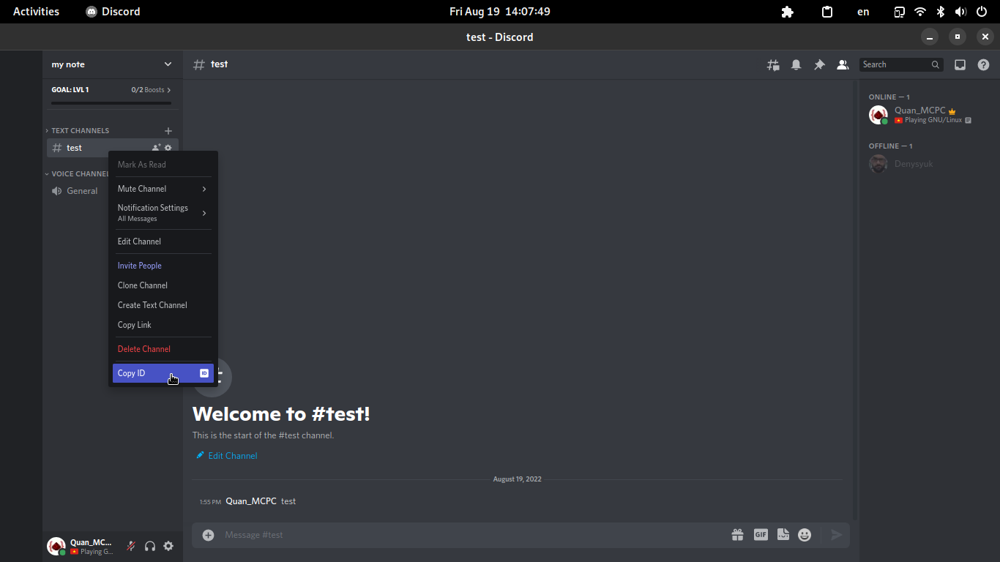

# Get Discord Messages (An Open-Source project)

## Menu
 - [Menu](#menu)
 - [Introduction](#introduction)
 - [Notice](#notice)
 - [Precaution](#precaution)
 - [Requirements](#precaution)
 - [Installation](#installation)
 - [Configuration](#configuration)
 - [How To Run](#how-to-run)
 - [How To Get](#how-to-get)
 - [Contribute](#contribute)

## Introduction
Have you ever want to get the messages from a channel from a server in Discord as a JSON file?

Well, if you haven't, then you don't need this. But if you have, then this is the perfect thing for you.

This is a project I made a while ago to extract the chat data from a channel using the Discord API.

While you can use this as a standalone program, you can extend it or modify it for other purposes like getting the messages from a server in a different language, or make a web app that can display the saved messages.

## Notice
While this project itself isn't breaking the Discord TOS, since it uses the user's token to work, this can be listed as self-bot, and can lead to a ban. Still, if you take the precautions to minimize the risk, then you should be fine. Refer to [Precautions](#precautions) for more information.

## Precaution
 - Use an alt (Note that some server might not allow alt account so besure to check the server rules)
 - Increase the delay between requests: In the `config.ts` file, change the `DELAY` constant to a higher value. (Like 1000, or 500 if you're risk taker)
 - Don't run the program too many times at the same time.

## Requirements
NodeJS v16.15.0 or higher (lower versions might work, but not tested)

## Installation
Install the dependencies:
```bash
npm install
```
Compile TypeScript files:
```bash
npx tsc
```

## Configuration
 - `config.ts`: This file contains the configuration for the NodeJS program.
   - `DELAY`: The delay between requests.
   - `ID_LIST`: The list of channel IDs to get the messages from.
   - `GUILD_ID`: The ID of server you want to get the messages from.
   - `LOG_DIR` and `DATA_DIR`: The directories to save the logs and the data relative to the root of the project.
   - `RETRY_AMOUNT`: The amount of times to retry the request if it fails.
   - ... and more can be found in the file.
 - `.env`: This file contains more sensitive information, like the Discord token.
   - `API_KEY`: The Discord token. (Refer to [How To Get](#how-to-get) to know how to get the Discord token)

## How To Run
Run the program:
```bash
npm run start
```

## How To Get
 - The Discord token:
   - In the Discord program, press `Ctrl` + `Shift` + `I` to open Developer Tools.
   
   - Go to the `Network` tab in the Developer Tools.
   
   - Type any message in any server (for this purpose, you should create a temporary server to do this) and press `Enter`.
   
   - Look at the `Network` tab, and find any request with the name `messages` or have the URL: `https://discord.com/api/v9/channels/xxxxxxxxxxx/messages`, and click on it.
   
   - Scroll down until you see the text `Authorization`, this is where Discord send the token. Copy the text after the `:` and paste it in the `API_KEY` constant in the `.env` file.
   

 - The ID of channels:
   - Enable the Developer Mode by going to User Settings -> Advanced and turn on Developer Mode.
   
   - Now switch to the server that you want to get the message, right click on the channel and select `Copy ID`.
   
   - Finally, add the ID into the `ID_LIST` constant in the `config.ts` file.

## Contribute
Open a pull request, create an Issue. It's that easy :)